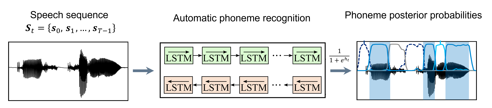
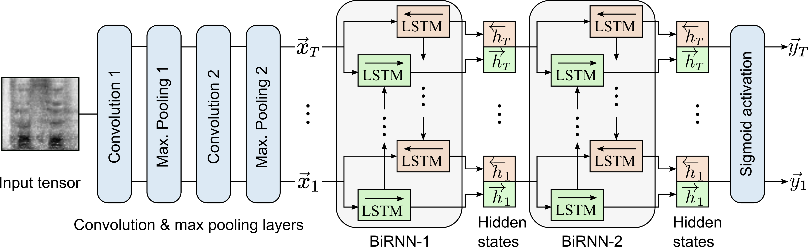

# PhonoQ
PhonoQ (Phono Cue) is a deep learning model used to compute phonemic features (also known as phonological features) related to duration, rate, rhythm*, and goodness of pronunciation* of 18 phonological classes

PhonoQ converts a sequence of speech frames $`\vec{S_t} = \{\vec{s}_0,\vec{s}_1,..., \vec{s}_{T-1}\}`$ into a sequence of phoneme posterior probabilities $`\vec{Y_t}[\vec{z}] = \{\vec{y}_0[\vec{z}],\vec{y}_1[\vec{z}],..., \vec{y}_{T-1}[\vec{z}]\}`$, where $`\vec{z}=1,2,\dots,z,\dots,Z`$  where $y_t[z]$ is the probability of occurrence of the $z$-th phonemic group in the $t$-th speech frame.

Phonemic features evaluated considering **Manner of articulation**, **Place of articulation**, and **Voicing**: 

| $`z`$  | Dimension | Class         | Phonemes                        | Brief description                      |
|----|-----------|--------------|---------------------------------|---------------------------------------------|
| 0  | -         | Silence      | -                               | Non-speech segments                        |
| 1  | Manner    | Stop         | /p/, /t/, /k/, /b/, /d/, /g/    | Total oral closure with rapid release      |
| 2  |           | Nasal        | /n/, /m/, /ŋ/                   | Airflow through the nasal cavity           |
| 3  |           | Trill        | /r/, /ʀ/                        | Turbulent airflow                          |
| 4  |           | Fricative    | /s/, /ʃ/, /z/, /f/              | Hissing sounds due to turbulent airflow    |
| 5  |           | Approximants | /j/                             | Hissing sounds without turbulent airflow   |
| 6  |           | Lateral      | /l/                             | The air passes at the sides of the tongue  |
| 7  |           | Vowel        | /a/, /e/, /i/, /o/, /u/         | Vibration of the vocal folds               |
| 8  | Place     | Labial       | /p/, /b/, /m/, /f/, /v/         | Lips and teeth                             |
| 9  |           | Alveolar     | /t/, /d/, /n/                   | Tip of the tongue and alveolar ridge       |
| 10 |           | Velar        | /k/, /g/, /ŋ/                   | Back of the tongue and soft palate         |
| 11 |           | Palatal      | /j/                             | Front of the tongue and hard palate        |
| 12 |           | Postalveolar | /ʃ/                             | Blade of the tongue                        |
| 13 |           | Central      | /a/, /aː/                       | Tongue halfway in the mouth                |
| 14 |           | Front        | /i/, /e/                        | Tongue on the front of the mouth           |
| 15 |           | Back         | /u/, /o/                        | Tongue on the back of the mouth            |
| 16 | Voicing   | Voiceless    | /p/, /t/, /k/, /ʃ/, /s/         | No vibration of the vocal folds            |
| 17 |           | Voiced       | /m/, /n/, /b/, /d/, /g/, /a/    | Vibration of the vocal folds               |

# Architecture

# Phonemic features
For each phonemic group $`z`$, the following features are computed:
 - $`\mathrm{MaxPh}`$: Average of the maximum phoneme posteriors.
 - $`LLR-Ph`$: Average posterior log-likelihood ratio:  $`LLR = \log \left(\frac{p[z]}{1-p[z]}\right)`$ with $`p[z] =\frac{1}{T}\displaystyle\sum_{t=0}^{T}\vec{y_t}[z]`$ where $`p[z]`$ is the average posterior probability of the $`z`$-th phoneme group.
 - $`\mathrm{durPh}`$: Average phoneme duration.
 - $`\mathrm{stdPh}`$: Standard deviation of phoneme duration.
 - $`rPVI/nPVI`$: raw and normalized Pairwise Variability Index to measure the duration variability of successive vowels and consonants [1]:
   
   $`rPVI = \frac{1}{D-1}\displaystyle\sum_{i=1}^{D-1}\left|d_i-d_{i+1} \right|`$;  $`nPVI = \frac{100}{D-1}\displaystyle\sum_{i=1}^{D-1}\left| \frac{d_i-d_{i+1}}{0.5(d_i+d_{i+1})} \right|`$
# Cite as
- Arias-Vergara, T. (2022). Analysis of Pathological Speech Signals. Logos Verlag Berlin GmbH,Vol. 50.

# Related publications
 - Arias-Vergara, T., Pérez-Toro P.A., Liu X., Xing F., Stone M., Zhuo J., Prince J., Schuster M., Noeth E., Woo J., & Maier, A. (2024). Contrastive Learning Approach for Assessment of Phonological Precision in Patients with Tongue Cancer Using MRI Data. In Proceedings of the 25th  Interspeech, 927-931.
 
 - Arias-Vergara, T., Londoño-Mora, E., Pérez-Toro, P.A., Schuster, M., Nöth, E., Orozco-Arroyave, J.R., Maier, A. (2023) Measuring Phonological Precision in Children with Cleft Lip and Palate. Proceedings of the 24th INTERSPEECH, pp. 4638-4642.

- Pérez-Toro, P. A., Rodríguez-Salas, D., Arias-Vergara, T., Bayerl, S. P., Klumpp, P., Riedhammer, K., ... & Orozco-Arroyave, J. R. (2023, June). Transferring Quantified Emotion Knowledge for the Detection of Depression in Alzheimer’s Disease Using Forestnets. In Proceedings of the IEEE International Conference on Acoustics, Speech and Signal Processing (ICASSP), pp. 1-5.

- Pérez-Toro, P.A., Arias-Vergara, T., Braun, F., Hönig, F., Tobón-Quintero, C.A., Aguillón, D., Lopera, F., Hincapié-Henao, L., Schuster, M., Riedhammer, K., Maier, A., Nöth, E., Orozco-Arroyave, J.R. (2023) Automatic Assessment of Alzheimer's across Three Languages Using Speech and Language Features. Proceedings of the 24th INTERSPEECH, pp. 1748-1752.

- Arias-Vergara, T., Klumpp, P., Vasquez-Correa, J. C., Nöth, E., Orozco-Arroyave, J. R., & Schuster, M. (2021). Multi-channel spectrograms for speech processing applications using deep learning methods. Pattern Analysis and Applications, 24, 423-431.

 ### References
 [1] Grabe, E. and Low, E. L. (2002). Durational variability in speech and the rhythm class hypothesis. Papers in laboratory phonology, 7(515-546)

- Arias-Vergara, Tomás, Orozco-Arroyave, J. R., Cernak, M., Gollwitzer, S., Schuster, M., Nöth., E. (2019). Phone-attribute posteriors to evaluate the speech of cochlear implant users. In Proceeding of the 20th INTERSPEECH, Graz, Austria, pp. 3108-3112. 

